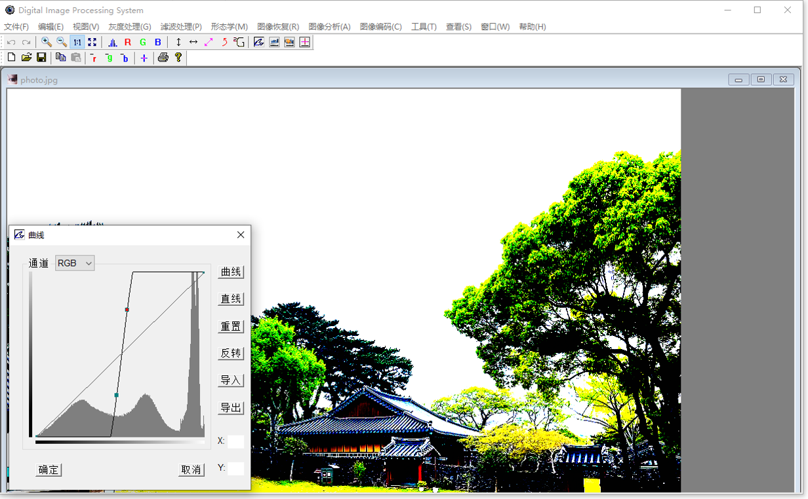

# DIP_System

This is an MFC-based digital image processing program that primarily implements functions such as grayscale transformation (curves, levels), geometric transformation (scaling, rotation), and filtering (spatial filtering, frequency domain filtering, FFT).

This program was written by me during my studies, with some code sourced from the internet (GitHub, web pages, forums, etc.).

这是一个基于MFC的数字图像处理程序，主要实现了对图像进行灰度变换（曲线、色阶）、几何变换（缩放、旋转）、滤波（空间滤波、频域滤波、FFT）等功能。

此程序是本人在读书期间所写(2014—2016)，部分代码来源于互联网（GitHub、网页、论坛等）。

# 编译环境

This program uses Visual Studio 2019 as compiler. Howerver an old IDE may be also work.

该程序使用 `Visual Studio 2019` 作为编译器，然而旧版 IDE 也可能可以。
在 DeMo目录有一个基于 `Visual Studio 2010` 编译好的程序：[DeMo](./DeMo/DIP_System.exe)
